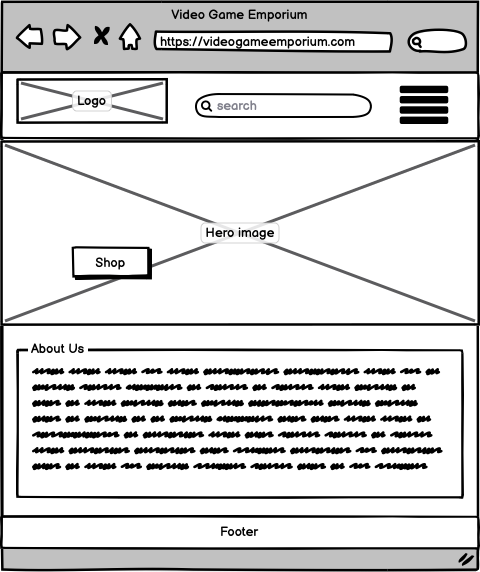

# Video Game Emporium

* Video Game Emporium is a website designed to allow users browse and purchase video game related products.
A deployed link is available [here.](https://video-game-emporium-ms4.herokuapp.com/)

* This website is a full-stack web application using Django framework, HTML, CSS and JS.

* IMPORTANT NOTICE!!
    - This website is for educational purposes and the stripe functionality is set up only to accept the test card details below. 
  
     - To use the stripe function use the following details.

        - Card Number : 4242 4242 4242 4242
        - Expiry Date : Any date thats into the future.
        - Any CVC number.

    - DO NOT USE YOUR PERSONAL CARD DETAILS.

## Showcase of the site


## UX

## Goals

* The aim of the website is to allow users to browse the range of products the website has to offer, add products to a shopping cart and purchase them. the sttock is managed by superusers.

### Viewing and navigation


### Registration and accounts


### Product searching and sorting


### Purchases and checkout


### Management


### Site information


### Contact information


## Structure/Features

### Logo and Navigation bar

* The name/logo of the website, Video Game Emporium, is located on the left of the navbar, along with the ability to return to the home page just by clicking on the logo.
* The navigation links are located on the right of the navbar, which links to the other available pages. Here users can easily use these links to navigate from each webpage.
* There also is a search bar located in the centerof the nav, this allows the user to search for products using a search term.
* For smaller devices, the navigation bar changes slightly with the navigation links droping underneath while still keeping its size, allowing the user to still access them with only one action. 


### Header

* The header displays a delivery cost banner, notifying the users and potential customers about a free delivery thershold.


### Footer

* The footer contains external links to both the Github repository and The Code Institute.
* The footer also cotainers links to external social media sites.


### Home page

* The home page is the landing page for the website, it is the first page the user views when entering the website. It contains text along with a button that directs the user to the products page.


### Products page

* The products nav link in the header, once clicked, gives the user to choice which category they would like to view, along with the ability to view all products.

  - 

* The products page contains the products available on the site. It also displays the amount of products on that page, along with a dropdown for if the user would like to sort the products, for example alphabetically descending.

  - 

### Products detail page

* The products detail page displays information about the product that the user selected. It contains the price, the products image and the description of the product. It also contains the products size, if appilcable.

* The page also contains a input field that allows the user to increase or decrease the quantity of the product the user would like to add to their cart. It also contains two buttons, a 'Keep shopping' button that returns the user back to the product page and a 'Add to Cart' button, that allows the user to add the selected product and the quantity of the product they have choosen.


### Shopping Cart

* The shopping cart initially shows text that notifies the user that their cart is currently empty, with a button that redirects them to the products page to browse.

  - 

* Once there is atleast one product within the cart, the cart page will update and display the products currently in the cart. The cart contains the products relevant information along with the quantity and the sub total of the product.
* At the bottom of the page is the grand total, along with the carts total and the delivery charge.

  - 

* If the users current cart total is below the free delivery threshold, the user will be notfiied that they could get free delivery if spend they spend X amount.

  - 

### Checkout page

* The checkout page contains a form that the user can fill in with their delivery information, with the option of saving their information for next time, located underneath said form.
* To the right of the form is the order summary containing the users selected products, their relevant information, sub total of each product, order total, delivery cost and grand total. Above the order summary is a button that if interacted with, redirects the user back to the cart where they can edit their current cart.
* At the bottom of the page contains a input where they can enter their payment card information along with a checkout buttons. Interacting with the button, provided the delivery information is valid and the payment card is accepted, the order will be processed and if successful a order confirmation will be displayed along with an email sent to the users email address. If the form is invalid or the payment card isn't accepted, this will notify the user of any errors to rectify before submitting the information again.


### Order confirmation

* The order confirmation page triggers when a order has been successfully sumbitted by a user. It contains the relevant information of the items they purchased, along with their delivery information and their billing information which contains the delivery cost, sub total and grand total.


### Profile page

* The profile page shows any relevant information that is linked to the current logged in user.

  - The users delivery information is displayed on the left, with a button that allows users to udpdate their delivery information.

  - If applicable, the right handside displays the order history. This is a list of orders that have been placed by the user with a berief overview of what they ordered. A link is present that allows to the user to be taken to the past confirmation of that respective order.


### Log in page

* The login page contains two input fields, one for their username or email and one for their password. Filling these fields with their details and clicking sign in takes the user to the home page and notifies the user that they have successfully signed in. The user can also tick the remember me box for the website to remeber their log in details for next time they log in.

* The page also contains text notifiying the user that if they are not a user, they can use the provided 'sign up' link to take the user to the sign up page, that then allows the user to create an account.

* lastly the page also contains text that notifies the user that if they have forgotten their password, they can interact with the provided link to reset their password.


### Sign up page

* The sign up page cotains input fields that allows the user to fill in their email, username and password, once interacting with the 'sign up' button. The user will be notified that an email confirmation of the accounts creation has been sent to the users email address.

* The page also contains text notifiying the user that if they are a existing user, they can use the provided 'sign in' link to take the user to the log in page, that then allows the user log in to their account.


### Deletion modals

* The deletion/removal modals are used as a form of defensive programming, clicking any delete/remove button will cause the modal to appear, asking if the user would like to continue. The delete modal only shows to super users as only they can see the delete button on products.


### Super-user only features

* Managing stock:

  - Super-users have the ability to manage stock, by either deleting the item from the database or editing the products information. This can either be accessed on the products page or the stock management page. Superusers can also interact with the 'Add stock' button within this page, this redirects the superuser to the Add product page. These options along with the stock management page is only accessible to super users, if the current user is not, these will not be visable.

  

* Edit products page:

  - The edit products page contains the details of the product that the superuser is editing, here the superuser can edit the details and interacting with the 'Edit product' button updates the altered details of that product and saves it to the database. Interacting with the 'Cancel button' will redirect the superuser back to the stock management page and reverts any changes in the edit product page.

  

* Add products page:

  - The add products page contains a form that superusers can fill in in order to create a new product, at the bottom contains a Image section, which allows the superuser to upload an image of the product. Once the 'Add product' button at the bottom of the form has been interacted with, this posts the form and sends the products information to the database, thus creating the product, that now can be viewed within the stock management page or products page.

  

### Future features

* The ability for users to contact the site/admin via email using a dedicated page.

## Design

### Images

* The images used for the products are from various wesbite but are used only for educational purposes, all rights are with the respective websites from where the images are sourced.

- [Terraria t-shirt](https://www.amazon.co.uk/Terraria-Boss-Rush-Hardmode-T-Shirt/dp/B07ZHVLPP6)
- [Pokemon ETB](https://magicmadhouse.co.uk/pokemon-pokemon-go-elite-trainer-box)
- [Pokemon booster pack](https://magicmadhouse.co.uk/pokemon-swsh-vivid-voltage-booster-pack)
- [Xbox series X](https://www.smythstoys.com/uk/en-gb/video-games-and-tablets/xbox-gaming/xbox-series-x-%7C-s/xbox-series-x-%7C-s-consoles/xbox-series-x-1tb-console/p/192012)
- [Playstation 5](https://www.google.com/url?sa=i&url=https%3A%2F%2Fwww.currys.co.uk%2Fproducts%2Fsony-playstation-5-with-additional-white-controller-headset-fifa-23-and-call-of-duty-bundle-10243960.html&psig=AOvVaw0R5hxpPEgLJq2nVVpkLZnI&ust=1668356246634000&source=images&cd=vfe&ved=0CBAQjhxqFwoTCMi8zd-GqfsCFQAAAAAdAAAAABAD)
- [Stray](https://www.amazon.co.uk/iam8bit-Stray-PS5/dp/B0B63M9DLC)
- [Headset](https://www.amazon.co.uk/SteelSeries-Arctis-Wireless-Headphone-PlayStation/dp/B07GFRPR2D)
- [Trousers](https://www.vanillaunderground.com/products/call-of-duty-skull-all-over-print-mens-loungepant?variant=27925536342039&currency=GBP&utm_medium=product_sync&utm_source=google&utm_content=sag_organic&utm_campaign=sag_organic&gclid=CjwKCAiAvK2bBhB8EiwAZUbP1OfprI2Vh-X7a7o7PzsA6G4rpep0UoM2GkW97LQFb7_iaNOPC3wIgRoC0WEQAvD_BwE)
- [Mug](https://www.grindstore.com/products/adventure-time-jake-mug_34125.html?gclid=CjwKCAiAvK2bBhB8EiwAZUbP1GEo5vDXHhDnElwBsRhU8BbI99Eut9gq0z28BK8wgTfM2vSqvvLyThoCc3AQAvD_BwE)
- [Minecraft](https://en.wikipedia.org/wiki/Minecraft)
- [No Image](https://commons.wikimedia.org/wiki/File:No_Image_Available.jpg)

* The image for the background is used to work well with the websites theme along with the retro look of the games from the past.

  - The image was sourced [here.](https://wallpapersafari.com/w/SkhFu9)

### Colour scheme

* The colors of purple and black used throughout help contrast the white text.
 - The two colors also help ease the users eyes. It reduces the light emitted by device screens while maintaining the minimum colour contrast ratios required for accessability.
* The white colours of the delivery banner and checkout along with the black text allows the users to see what they are purchasing as both colours have the greatest contrast.

### Fonts 

* The main font used throughout the website is Open Sans. A fullback font of Sans-Serif is used just in case for whatever reason is that the font isn't loaded correctly.
  - The link to link to the font Open Sans can be found [here.](https://fonts.google.com/specimen/Open+Sans?query=open+sans)
* The font used for the logo is Silkscreen and can be found [here.](https://fonts.google.com/specimen/Silkscreen?query=silk)

## Wireframes

The wireframes for the webpage can be viewed here.

* 

* 

* 

* 

* 

* 

* 

* 

## ERD diagram

The ERD diagram for the project can be viewed here.

* 

## Languages

* [HTML5](https://en.wikipedia.org/wiki/HTML5)
* [CSS](https://en.wikipedia.org/wiki/CSS)
* [JavaScript](https://en.wikipedia.org/wiki/JavaScript)
* [Python](https://en.wikipedia.org/wiki/Python_(programming_language))

## Tools

* [Gitpod](https://www.gitpod.io/) - Used as a cloud-based IDE.
* [Github](https://github.com/) - Used to secure code online.
* [Git](https://git-scm.com/) - Version control.
* [Django](https://www.djangoproject.com/) - Used as a ORM.
* [Bootstrap](https://getbootstrap.com/) - Used for responsive front-end CSS framework.
* [Balsamiq](https://balsamiq.com/) - Used to create wireframes.
* [Font Awesome](https://fontawesome.com/icons) - For the various icons used.
* Google Chrome Dev tools - for proofreading code.
* [Am I Responsive?](http://ami.responsivedesign.is/) - To see the responsiveness of the website on multiple devices.
* [WebAIM](https://webaim.org/resources/contrastchecker/#:~:text=WCAG%202.0%20level%20AA%20requires,such%20as%20form%20input%20borders) - Used to check the contrast between foreground and background colours.
* [Stripe](https://stripe.com/ie) - Stripe has been used for the payment section of the site.

* [Heroku](https://signup.heroku.com/) - Used to deploy the website.

* [Amazon AWS](https://aws.amazon.com/) - Used to store the static files and the images for the site.
* [Gunicorn](https://gunicorn.org/) - Used for deploying the project to Heroku.

## Testing

To view all testing documentation click [here](TESTING.md)

## Deployment

The live deployed application can be found at [video-game-emporium-ms4](https://video-game-emporium-ms4.herokuapp.com/).

### Live Deployment

#### Deployment to Heroku

The project was deployed using [Heroku](https://dashboard.heroku.com/) and [AWS](https://aws.amazon.com/), this was done using the following steps:

1. When the project is ready to deploy, use the ``` pip3 install ``` command to install; gunicorn, psycopg2 and dj-database-url.
2. Freeze the requirements of the project by using ``` pip3 freeze > requirements.txt ```. This adds all the requirements/packages into a text folder named 'requirements'.
3. Create a Procfile and add the following code: web: ``` gunicorn vg_emporium.wsgi:application ```. A [Procfile](https://www.codementor.io/@populardemand/the-heroku-procfile-1sxnqu1rqo) is a file that specifies the commands that are executed by an Heroku app on startup.
4. Commit these additions and push them using the followig commands:
  1. ``` git add . ```
  2. ``` git commit -m '<your relevant message here>' ```
  3. ``` git push ```
5. Go to [Heroku](https://dashboard.heroku.com/) and either log in or create a account.
6. Once at the dashboard, click the 'New' button, located at the top right of the page and select 'Create new app' and folow the steps on Heroku.
7. Once the app has been created, click the 'Resources' tab and using the add-ons search bar, add 'Heroku Postgres', choose the 'Hobby Dev' plan and submit the order form, this adds it to the project.
8. Now navigate to the 'Settings' tab, within the settings, navigate to the config vars section and click on 'Reveal Config Vars' and add the required variables for the project which should be the following:
  AWS_ACCESS_KEY_ID --- 'Insert the AWS access key ID' (Will be sourced when you set up AWS)
  AWS_SECRET_ACCESS_KEY --- 'Insert the AWS secret access key' (Will be sourced when you set up AWS)
  DATABASE_URL --- 'The Heroku postgres db url'
  EMAIL_HOST_PASS --- 'The emails password'
  EMAIL_HOST_USER --- 'The email used for sending email confirmations'
  SECRET_KEY --- 'Insert your own secret key here'
  STRIPE_PUBLIC_KEY --- 'Insert your own stripe public key here'
  STRIPE_SECRET_KEY --- 'Insert your own stripe secret key here'
  USE_AWS --- True
9. Now the Config Variables have been set up, navigate to the 'Deploy' tab and select the 'GitHub' Deployment method.
10. Choose the repo that is being deployed and choose the 'Automatic Deploys' option.
11. Back in the local environment, within the 'settings.py' file, import ``` dj_database_url ``` at the top.
12. Comment out the SQLite database settings:
  ```python
  DATABASES = {
        'default': {
            'ENGINE': 'django.db.backends.sqlite3',
            'NAME': os.path.join(BASE_DIR, 'db.sqlite3'),
        }
  }
  ```
  And replace it with the following Postgres code:
  ```python
    DATABASES = {
        'default': dj_database_url.parse('DATABASE_URL')
    }
  ```
  The 'DATABASE_URL' value is from Herokus Config Vars.
13. Now that the projects database is being directed to the new Heroku database, migrate the models using the following commands:
  1. You need to check first what models are going to migrate to the database:
  ``` python3 manage.py makemigrations --dry-run ```
  2. Proceed to make said migrations:
    ``` python3 manage.py makemigrations ```
  3. Check the plan for the migration of the models (double check evrything looks good to migrate):
    ``` python3 manage.py migrate --plan ```
  4. Complete the migration:
    ``` python3 manage.py migrate ```

14. Comment the Postgres database code you added and uncomment the SQLite database code.
15. Use the following command to back up the current database and load it into a db.json file:
  ``` python3 manage.py dumpdata 'app_name' > db.json ``` (app_name being the name of the database you are backing up)
  This will create a file called db.json.
16. Comment the SQLite db code and uncomment the Postgres db code.
17. Use the following command to upload the database to the Postgres db:
  ``` python3 manage.py loaddata db.json ``` (Once the data has loaded, you can simply delete the json file)
16. Create a superuser for the new database and follow the steps in the terminal:
  ``` python3 manage.py createsuperuser ```
17. Remove the Postgres db code and add the DATABASE_URL and its value to the env.py, it should look like this:
  ```python
  os.environ.setdefault('DATABASE_URL', '<url here>')
  ```
  This ensures the url does not get saved to version control.
18. Commit/Push the changes.
19. Create a if-else statment within the settings.py file to use the Postegres database if 'DATABASE_URL' is available and if it is not, use the SQLite database
  ``` python
    if 'DATABASE_URL' in os.environ:
    DATABASES = {
        'default': dj_database_url.parse(os.environ.get('DATABASE_URL'))
    }

    else:
        DATABASES = {
            'default': {
                'ENGINE': 'django.db.backends.sqlite3',
                'NAME': os.path.join(BASE_DIR, 'db.sqlite3'),
            }
        }
  ```
  The Postgres database is now ready to use.
20. Within the GitPod terminal, log into Heroku:
  ``` heroku login -i ```
21. Now disable 'COLLECTSTATIC' with the following command:
  ``` heroku config:set DISABLE_COLLECTSTATIC=1 --app <app name> ```
22. Add ``` ALLOWED_HOSTS = ['<app-name.herokuapp.com>', 'localhost'] ``` to settings.py.
23. Commit and push the changes to GitHub.
24. And then deploy to Heroku using the following commands :
  ``` heroku git:remote -a <app name> ```
  ``` git push heroku master ```

#### AWS

All Static and media files for the deployed project are hosted in a Amazon Web Services(AWS) S3 bucket. To create your own bucket, please follow this user guide on how to create one, found [here.](https://docs.aws.amazon.com/AmazonS3/latest/userguide/creating-bucket.html)

To connect AWS to your deployed project follow these steps:

1. In the gitpod terminal, install boto3 and django-storages using the following command:
  ``` pip3 install ```
2. Freeze the new requirements into the 'requirements.txt' file.
3. Add 'storages' to INSTALLED_APPS in settings.py.
4. Add the following code to settings.py to connect the AWS bucket you created to the project:
  ```python
  if 'USE_AWS' in os.environ:
    # Cache control
    AWS_S3_OBJECT_PARAMETERS = {
        'Expires': 'Thu, 31 Dec 2099 20:00:00 GMT',
        'CacheControl': 'max-age=94608000',
    }
    # Bucket config
    AWS_STORAGE_BUCKET_NAME = 'bucket name'
    AWS_S3_REGION_NAME = 'eu-west-2'
    AWS_ACCESS_KEY_ID = os.environ.get('AWS_ACCESS_KEY_ID')
    AWS_SECRET_ACCESS_KEY = os.environ.get('AWS_SECRET_ACCESS_KEY')
    AWS_S3_CUSTOM_DOMAIN = f'{AWS_STORAGE_BUCKET_NAME}.s3.amazonaws.com'

    # Override static and media URLs in production
    STATIC_URL = f'https://{AWS_S3_CUSTOM_DOMAIN}/{STATICFILES_LOCATION}/'
    MEDIA_URL = f'https://{AWS_S3_CUSTOM_DOMAIN}/{MEDIAFILES_LOCATION}/'
  ```
  The AWS access key and secret key will be within the env.py, to keep them hidden from version control.
5. In the Config Vars on Heroku add the AWS_ACCESS_KEY_ID and AWS_SECRET_ACCESS_KEY keys and its values.
6. Also in the Config Vars, add the USE_AWS key and set the value of it to 'True'.
7. finally in the Config Vars, remove the DISABLE_COLLECTSTATIC key and its value, since on the next deployment to Heroku, Django will collect the static files automatically and upload them to the AWS S3 bucket.
8. Now to tell Django that AWS S3 needs to collect the static files and any uploaded images, to do so, follow these steps:
  1. Create a custom_storages.py file and import the following:
    ```python
      from django.conf import settings
      from storages.backends.s3boto3 import S3Boto3Storage
    ```
  2. within the custom_storages file add the following code:
    ```python
      class StaticStorage(S3Boto3Storage):
      location = settings.STATICFILES_LOCATION


      class MediaStorage(S3Boto3Storage):
      location = settings.MEDIAFILES_LOCATION
    ```
  3. To use this file add the following code to the code added in step 4 (line 396):
    ```python
      # Static and media files
      STATICFILES_STORAGE = 'custom_storages.StaticStorage'
      STATICFILES_LOCATION = 'static'
      DEFAULT_FILE_STORAGE = 'custom_storages.MediaStorage'
      MEDIAFILES_LOCATION = 'media'
    ```
    Along with the following code to override the static and media URLs in production:
    ```python
      STATIC_URL = f'https://{AWS_S3_CUSTOM_DOMAIN}/{STATICFILES_LOCATION}/'
      MEDIA_URL = f'https://{AWS_S3_CUSTOM_DOMAIN}/{MEDIAFILES_LOCATION}/'
    ```
9. Commit and push all the changes, now, whenever the project is deployed to heroku, when ever collectstatic is run when pushing any changes, any static files will be collected into either static file that are located in the AWS S3 bucket.
10. Within the S3 bucket, create a folder called media.
11. In the media folder, click the 'Upload' button and upload all the product files used in the project.
12. Click 'Next' and under manage public permissions select grant public read access to these objects.
12. Click 'Next' to the end then click 'Upload' to upload all the product images selected.

If following the steps above, the project now should be fully deployed to Heroku and connected to AWS S3 so any static files/media is automatically collected to the bucket in their respective folders.

### Local Deployment

*Gitpod* IDE was used to write the code for this project.

To make a local copy of this repository, you can clone the project by typing the follow into your IDE terminal:
- `git clone https://github.com/joshfreeman00/VideoGameEmporium-MS4.git`

You can install this project's requirements (where applicable) using: `pip3 install -r requirements.txt`.

Create an `env.py` file, and add the following environment variables:

```python
import os
os.environ.setdefault("IP", "0.0.0.0")
os.environ.setdefault("PORT", "5000")
os.environ.setdefault('SECRET_KEY', 'insert your own random secret key here')
os.environ.setdefault('STRIPE_PUBLIC_KEY', 'insert your own stripe public key here')
os.environ.setdefault('STRIPE_SECRET_KEY', 'insert your own stripe secret key here')
os.environ.setdefault('DEBUG', 'True')
```

Note:
  - Your own stripe variables can be found on your [stripe](https://stripe.com/gb) dashboard.

Next you will need to migrate the database models used to set up your own database:

1. You need to check first what models are going to migrate to the database:
  ``` python3 manage.py makemigrations --dry-run ```
2. Proceed to make said migrations:
  ``` python3 manage.py makemigrations ```
3. Check the plan for the migration of the models (double check evrything looks good to migrate):
  ``` python3 manage.py migrate --plan ```
4. Complete the migration:
  ``` python3 manage.py migrate ```

Finally, you will need to create a super user to access the admin panel for the site:
  ``` python3 manage.py createsuperuser ```
  After typing that into the terminal, follow the steps within the terminal.

If all the steps have been followed correctly, you can then run the project by using this command:
  ``` python3 manage.py runserver ```

## Credits

* [Font Awesome](https://fontawesome.com/icons) - The icons used.
* [Bootstrap](https://getbootstrap.com/) - For CSS formatting and styling.
* [Stack Overflow](https://stackoverflow.com/) - For help debugging and fixes throughout.
* My mentor - For helpful tips and debugging.
* Boutique Ado Walkthrough project - For guidance on code that was used from Code Institute.
* [Scott](https://github.com/Code-Institute-Solutions/boutique_ado_v1/commit/de7ad2067ac1b5de37a4cd8b9f4ddf572a4bf6c7#diff-7653e5eaf8a2f40ba60d0de39ab6c27cfb9c64c80807631498ebb9295c51744a
) - For the minus quantity bug within the cart.


## Acknowledgements

* To create this website, I used material and information covered in the Full Stack Development course by Code Institute. As well as information from the gitSlack Community Channels, Stack Overflow and W3Schools.

* Tim Nelson, my mentor, for reviewing my work and providing useful, help, feedback and advice throughout.