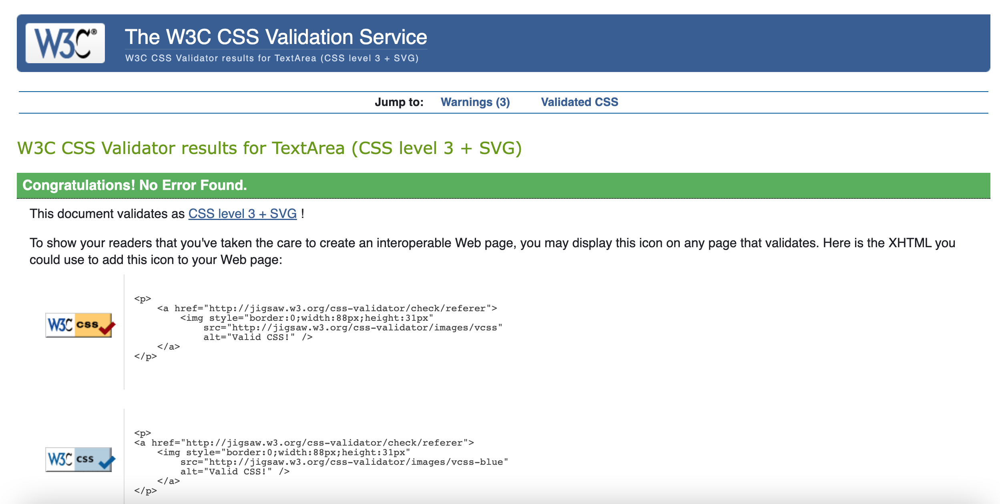
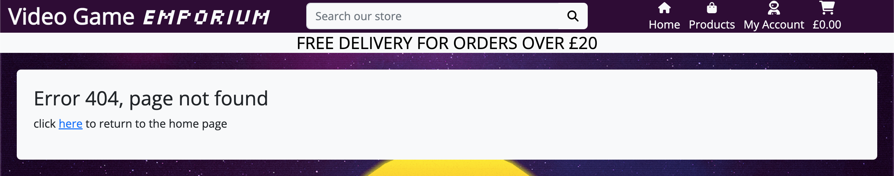
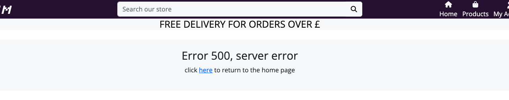
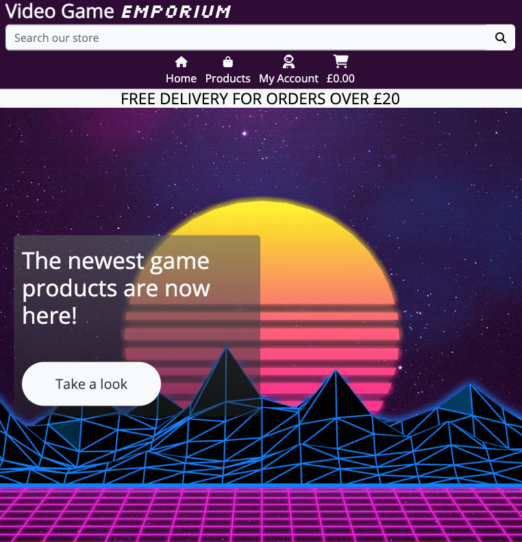
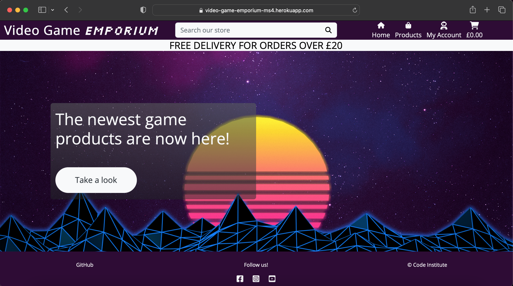

# Testing

To return to the readme click [here.](README.md)

## Code validation

### HTML validation

* Validation for the HTML can be found [here.]()

### CSS validation

* Validation for the CSS can be found [here.](https://jigsaw.w3.org/css-validator/validator?uri=https%3A%2F%2Fvideo-game-emporium-ms4.herokuapp.com%2F&profile=css3svg&usermedium=all&warning=1&vextwarning=&lang=en)

    - Note: any errors within this validation is to do with Bootstrap, if the CSS code is entered through direct input, no errors will show, as seen below:

    * 

### JS validation

* Validation for the JS can be found [here.](https://jshint.com/)

### Python Validation

## Defensive programming tests

### Error handling

* Error: 404

* Error: 500

## Responsiveness

* The following images will showcase how the project is shown on different devices and shows the responsiveness of the project.

    - Mobile devices:

    

    - Tablet devices:

    

    - Desktop devices:

    

## Browser Compatibility

* The following images shows the project being tested in both Chrome and Safari browsers.

    - Chrome

    

    - Safari

    

## User story testing

## Environment testing

* The following images are within two seperate environments, they have different URLs to validate this.

### Local environment

* The images below show the game within the local (development) environment of gitpod.

### Production environment

* The images below show the game within the production (deployed) environment of Heroku.

## Bugs

### Unfixed bugs

* There are no unfixed bugs that I am currently aware of.