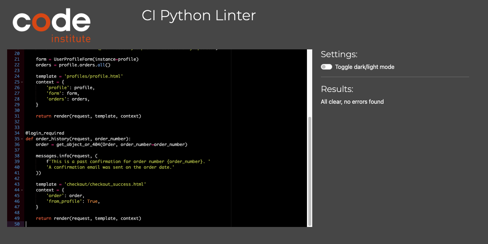
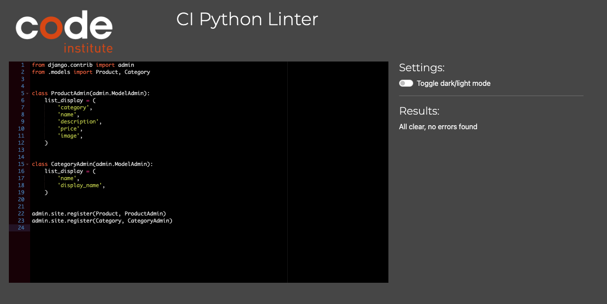
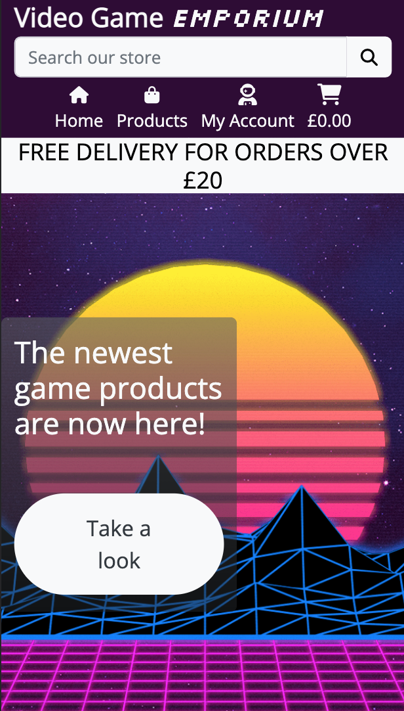

# Testing

To return to the readme click [here.](README.md)

## Code validation

### HTML validation

* Validation for the HTML can be found [here.](https://validator.w3.org/nu/?doc=https%3A%2F%2Fvideo-game-emporium-ms4.herokuapp.com%2F)

### CSS validation

* Validation for the CSS can be found [here.](https://jigsaw.w3.org/css-validator/validator?uri=https%3A%2F%2Fvideo-game-emporium-ms4.herokuapp.com%2F&profile=css3svg&usermedium=all&warning=1&vextwarning=&lang=en)

    - Note: any errors within this validation is to do with Bootstrap, if the CSS code is entered through direct input, no errors will show, as seen below:

    * 

### JS validation

* Validation for the JS can be found [here.](https://jshint.com/)

### Python Validation

* Cart app
    - context.py
        
    - urls.py
        
    - views.py
        

* Checkout app
    - admin.py
        
    - apps.py
        
    - forms.py
        
    - models.py
        
    - signals.py
        
    - urls.py
        
    - views.py
        

* Home app
    - urls.py
        
    - views.py
        

* Profiles app
    - forms.py
        
    - models.py
        
    - urls.py
        
    - views.py
        

* Stock app
    - admin.py
        
    - forms.py
        
    - models.py
        
    - urls.py
        
    - views.py
        

## Defensive programming tests

* For defensive programming, if the user is not logged in when trying to view their profile, it will ask them to log in. Even if the user bypasses this by using the url, it will still ask them to log in.

* For superuser only features (i.e access to stock managment page), if the user is not a superuser, an error toast will show indicating that they are not authorised, and redirects the user back to the home page.

### Error handling

* Error: 404

* Error: 500

## Responsiveness

* The following images will showcase how the project is shown on different devices and shows the responsiveness of the project.

    - Mobile devices:

    

    - Tablet devices:

    

    - Desktop devices:

    

## Browser Compatibility

* The following images shows the project being tested in both Chrome and Safari browsers.

    - Chrome

    

    - Safari

    

## User story testing

## Environment testing

* The following images are within two seperate environments, they have different URLs to validate this.

### Local environment

* The images below show the game within the local (development) environment of gitpod.

### Production environment

* The images below show the game within the production (deployed) environment of Heroku.

## Bugs

### Unfixed bugs

* There are no unfixed bugs that I am currently aware of.