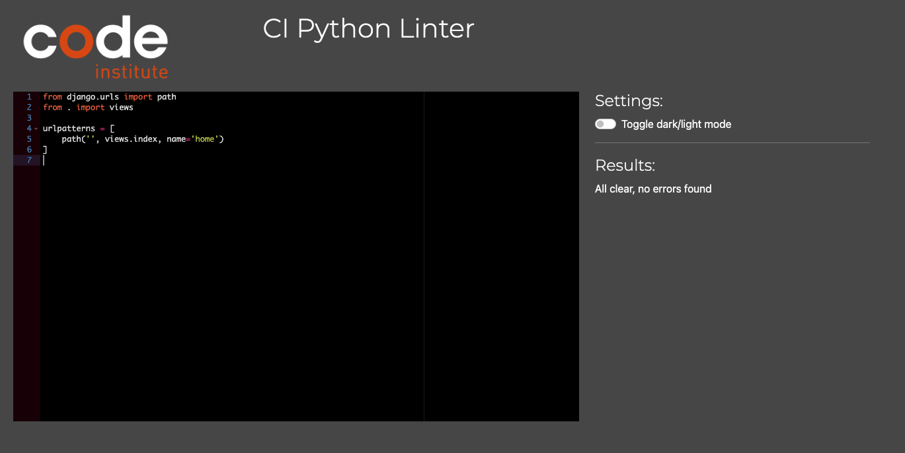
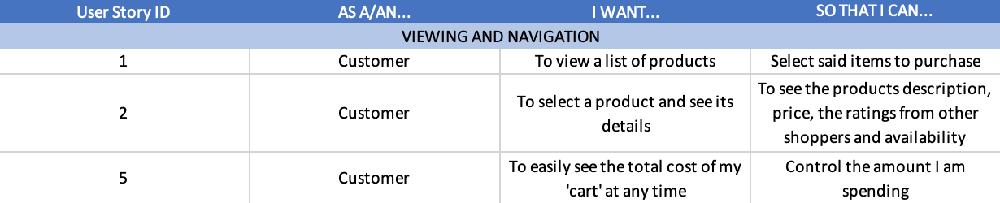
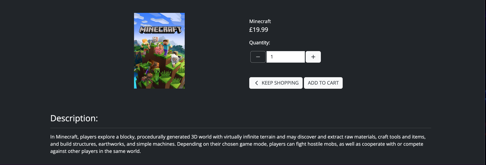
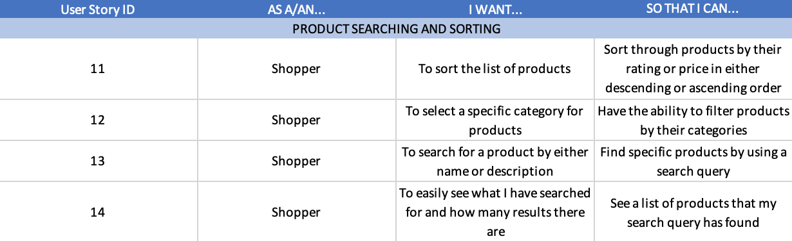
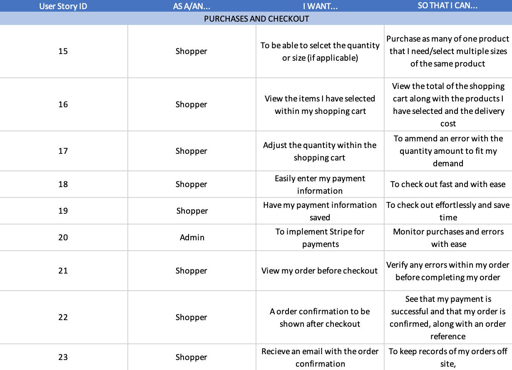
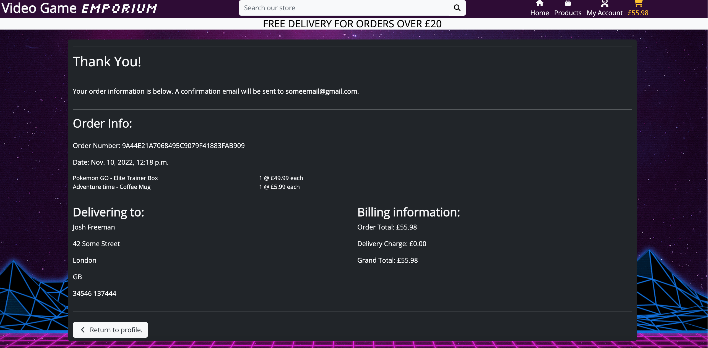
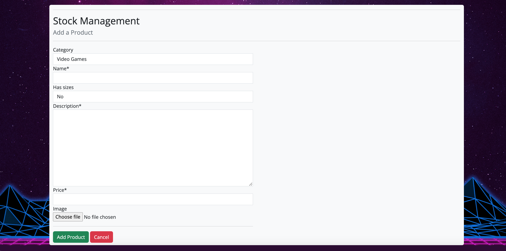

# Testing

To return to the readme click [here.](README.md)

## Code validation

### HTML validation

* Validation for the HTML can be found [here.](https://validator.w3.org/nu/?doc=https%3A%2F%2Fvideo-game-emporium-ms4.herokuapp.com%2F)

### CSS validation

* Validation for the CSS can be found [here.](https://jigsaw.w3.org/css-validator/validator?uri=https%3A%2F%2Fvideo-game-emporium-ms4.herokuapp.com%2F&profile=css3svg&usermedium=all&warning=1&vextwarning=&lang=en)

    - Note: any errors within this validation is to do with Bootstrap, if the CSS code is entered through direct input, no errors will show, as seen below:

    * 

### JS validation

* Validation for the JS can be found [here.](https://jshint.com/)

### Python Validation

* Cart app
    - context.py
        
    - urls.py
        
    - views.py
        

* Checkout app
    - admin.py
        
    - apps.py
        
    - forms.py
        
    - models.py
        
    - signals.py
        
    - urls.py
        
    - views.py
        

* Home app
    - urls.py
        
    - views.py
        

* Profiles app
    - forms.py
        
    - models.py
        
    - urls.py
        
    - views.py
        

* Stock app
    - admin.py
        
    - forms.py
        
    - models.py
        
    - urls.py
        
    - views.py
        

## Defensive programming tests

* For defensive programming, if the user is not logged in when trying to view their profile, it will ask them to log in. Even if the user bypasses this by using the url, it will still ask them to log in.

* For superuser only features (i.e access to stock managment page), if the user is not a superuser, an error toast will show indicating that they are not authorised, and redirects the user back to the home page.

### Error handling

* Error: 404

* Error: 500

## Responsiveness

* The following images will showcase how the project is shown on different devices and shows the responsiveness of the project.

    - Mobile devices:

    
    

    - Tablet devices:

    
    

    - Desktop devices:

    
    

## Browser Compatibility

* The following images shows the project being tested in both Chrome and Safari browsers.

    - Chrome

    

    - Safari

    

## User story testing

### Viewing and navigation

* 
    * User Story ID 1:
        - 
    * User Story ID 2:
        - 
    * User Story ID 5:
        * The carts price has a default value of £0.00 until a product is added to the cart. After the cart changes colour and the prices updates accordingly.
            - 

### Registration and accounts

* [accounts](docs/userstories/accounts.png)
    * User Story ID 6 & 7:
        * If the user interacts with the 'My Profile' nav link, options to register and log in can be found, each taking them to their respective page.
            - 
            - 
    * User Story ID 8:
        * If the user has forgotten their password, they can interact with 'Forgot password?' where they would be asked to fill in their email address, interacting with the reset button will send a email with a link to reset their password.
            - 
            - 
    * User Story ID 10:
        - 

### Product searching and sorting

* 
    * User Story ID 11:
        * Interacting with the 'Sort By' dropdown allows the user to sort by either price or alphabetically in ascending or descending order
            - 
    * User Story ID 12:
        * The user can interact with the products nav link and select any category they would like, doing so opens the product page with all of the current products in the category they have chosen.
            - 
    * User Story ID 13 & 14:
        * The user can use the search bar at the top of the site and search for a specific term, the search query will return anything that has the users search query within the products name or description and the amount of products returned.
            * An example of a user searching for 'po' returns 4 products is show below.
            - 

### Purchases and checkout

* 

    * User Story ID 15:
        * The user can select the quantity and size of the product on the products details page.
            - 
    * User Story ID 16 & 17:
        * The User can achieve all of this from the shopping cart.
            - 
    * User Story ID 18, 19, 20 & 21:
        * The User can achieve all of this from the checkout page.
        * The website uses stripe for easy payments, located at the bottom of the checkout form.
            - 
    * User Story ID 22:
        - 
    * User Story ID 23:
        - 

### Management

* 
    * User Story ID 24:
        * The admin can add products by navigating themselves to the 'Stock Management' page.
            - [stock_management](docs/testing/stock_management.png)
        * Here, the admin or superuser can interact with the 'Add product' button, which takes them to the add product page.
            - 
    * User Story ID 25:
        * The admin can edit products by either navigating themselves to the 'Stock Management' page or from the 'products' page.
            - [stock_management](docs/testing/stock_management.png)
            - 
        * Here, the admin or superuser can interact with the blue Edit text, which takes them to the edit product page for the specific product.
            - 
    * User Story ID 26:
        * The admin can edit products by either navigating themselves to the 'Stock Management' page or from the 'products' page.
            - [stock_management](docs/testing/stock_management.png)
            - 
        * Here, the admin or superuser can interact with the red Delete text, which causes a defensive modal to pop up, asking if they would like to continue, interacting with the 'delete' button will delete the product.
            - 

### Site information

* 
    * User Story ID 27:
        - 

### Contact information

* 
    * User Story ID 28:
        - 

## Environment testing

* The following images are within two seperate environments, they have different URLs to validate this.

### Local environment

* The images below show the game within the local (development) environment of gitpod.

### Production environment

* The images below show the game within the production (deployed) environment of Heroku.

## Bugs

### Unfixed bugs

* There are no unfixed bugs that I am currently aware of.